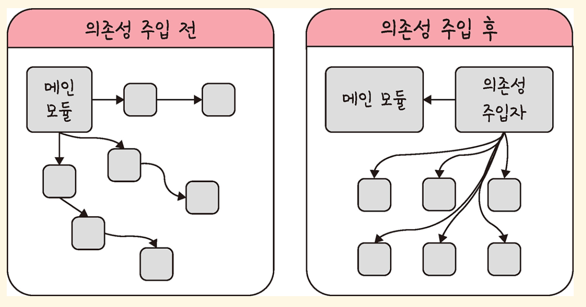

# 싱글톤패턴

## 싱글톤패턴이란?
싱글톤 패턴은 하나의 클래스가 오직 하나의 인스턴스만 가지도록 보장하는 디자인 패턴입니다. 이 패턴은 주로 데이터베이스 연결 모듈이나 설정 파일 관리처럼 하나의 인스턴스만 필요할 때 사용됩니다.

## 특징
1. 하나의 인스턴스만 존재: 클래스를 통해 생성된 인스턴스는 프로그램 전체에서 단 하나만 존재합니다.
2. 전역적으로 접근 가능: 이 인스턴스는 어디서든 접근할 수 있어 공유 자원으로 활용됩니다.
   
## 장단점

### 장점
- 비용 절감: 인스턴스 생성 비용이 줄어듭니다. 이미 생성된 인스턴스를 재사용하므로 메모리와 성능 면에서 효율적입니다.
- 일관성 보장: 하나의 인스턴스만 사용하므로 데이터의 일관성을 유지하기 쉽습니다.
  
### 단점
- 의존성 증가: 싱글톤 인스턴스에 너무 많은 모듈이 의존하면 코드의 결합도가 높아져 유지보수가 어려워질 수 있습니다.
- 테스트 어려움: 전역 상태를 공유하기 때문에 단위 테스트가 어려울 수 있습니다.

## 자바스크립트에서의 싱글톤 패턴
자바스크립트에서는 객체 리터럴({})이나 new Object를 사용해 객체를 생성하면, 각 객체는 서로 다른 인스턴스가 됩니다. 따라서 이 자체로는 싱글톤 패턴이 아닙니다.
```js
const obj = { a: 27 };
const obj2 = { a: 27 };

console.log(obj === obj2); // false
```
<u>obj와 obj2는 서로 다른 인스턴스이므로 싱글톤이 아닙니다.</u>

```js
class Singleton {
  constructor() {
    if (!Singleton.instance) {
      Singleton.instance = this;
    }
    return Singleton.instance;
  }

  getInstance() {
    return this;
  }
}

const a = new Singleton();
const b = new Singleton();
console.log(a === b); // true
```
- Singleton.instance가 이미 존재하면 새 인스턴스를 생성하지 않고 기존 인스턴스를 반환합니다.
- 따라서 a와 b는 동일한 인스턴스입니다.

## 데이터베이스 연결 예시

**데이터베이스 연결은 싱글톤 패턴이 매우 자주 사용되는 대표적인 사례**입니다.   
데이터베이스 연결은 일반적으로 애플리케이션 전체에서 하나의 연결만 유지하고, 이를 여러 모듈에서 사용하는 것이 효율적이기 때문입니다.

```js
const { MongoClient } = require("mongodb");

class MongoDB {
  constructor() {
    if (!MongoDB.instance) {
      this.client = new MongoClient("mongodb://localhost:3000", {
        useNewUrlParser: true,
        useUnifiedTopology: true,
      });
      MongoDB.instance = this;
    }
    return MongoDB.instance;
  }

  async connect() {
    if (!this.client.isConnected()) {
      await this.client.connect();
      console.log("MongoDB Connected!");
    }
    return this.client.db("myDatabase");
  }
}


const dbconnect = new MongoDB();

(async () => {
  const db1 = await dbconnect.connect();
  const db2 = await dbconnect.connect();

  console.log(db1 === db2); // true 
})();
```

## 의존성 주입
### 개념
싱글톤 패턴은 사용하기가 쉽고 굉장히 실용적이지만 모듈 간의 결합을 강하게 만들 수 있다는 장점이 있습니다. 이때 의존성 주입을 통해 모듈 간의 결환을 조금더 느슨하게 만들어 해결할 수 있습니다.

참고로 의존성이랑 종속성이라고도 하며 A가 B에 의존성이 있다는 것은 B의 변경 사항에 대해 A 또한 변해야 된다는 것을 의미합니다.


앞의 그림처럼 메인 모듈이 '직접' 다른 하위 모듈에 대한 의존성을 주기보다는 중간에 의존성 주입자가 이 부분을 가로채 메인 모듈이 '간접'적으로 의존성을 주입하는 방식이다.
이를 통해 메인 모듈(상위 모듈)은 하위 모듈에 대한 의존성이 떨어지게 된다. 참고로 이를 '디커플링이 된다'고도 한다.

### 의존성 주입의 장단점

#### 의존성 주입의 장점
- 모듈들을 쉽게 교체할 수 있는 구조가 되어 테스팅하기 쉽고 마이그레이션하기도 수월하다.
- 구현할 때 추상화 레이어를 넣고 이를 기반으로 구현체를 넣어 주기 때문에 애플리케이션 의존성 방향이 일관되고, 애플리케이션을 쉽게 추론할 수 있으며, 모듈 간의 관계들이 조금 더 명확해진다.
- 낮은 결합도로 변경에 용이하고, 다른 객체와의 협력 관계에 더 집중하게 해준다.

#### 의존성 주입의 단점
- 모듈들이 더욱더 분리되므로 클래스 수가 늘어나 복잡성이 증가된다.
- 약간의 런타임 패널티가 생기기도 한다.

### 의존성 주입 원칙
- 상위 모듈은 하위 모듈에서 어떠한 것도 가져오지 않아야 한다.
- 둘 다 추상화에 의존해야 하며, 이때 추상화는 세부 사항에 의존하지 말아야 한다.

## 정리
- 싱글톤 패턴은 하나의 클래스가 하나의 인스턴스만 가지도록 보장하는 패턴입니다.
- 장점: 비용 절감, 일관성 보장.
- 단점: 의존성 증가, 테스트 어려움.