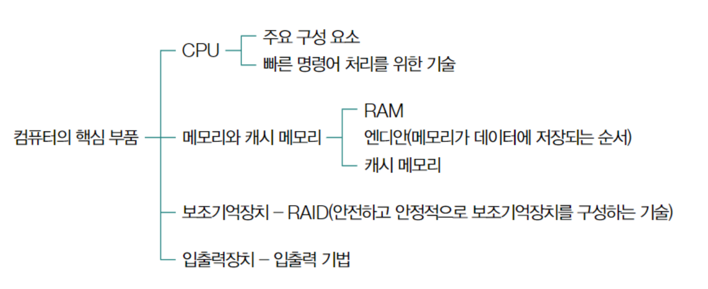
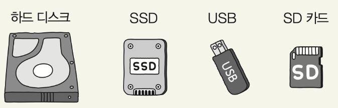
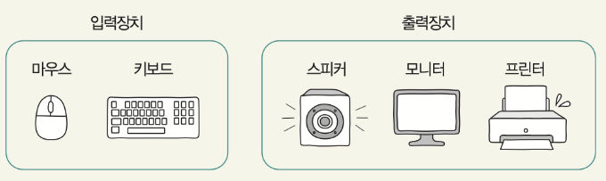

# 컴퓨터 구조의 큰 그림

## 컴퓨터 이해하는 정보
컴퓨터는 Javascript, 자바, C++, 파이썬과 같은 프로그래밍 언어를 직접 이해하지 못합니다. 컴퓨터는 데이터와 명령어로 변환한 뒤에 실행됩니다.
컴퓨터는 기본적으로 0과 1만을 이해할 수 있으므로 데이터 명렁어 또한 0과 1로 이루어져 있습니다. 즉, 컴퓨터는 0과 1만으로 다양한 숫자와 문자 데이터를 표현하며, 이 데이터를 활용해 명령어를 실행합니다. 이 명령어를 실행하는 주체가 CPU입니다. 컴퓨터는 복잡한 기계이지만, 그 핵심은 간단한 원리로 작동합니다.

## 컴퓨터의 핵심 부품

### CPU
컴퓨터가 이해하는 정보에는 크게 데이터와 명령어가 있습니다. 이러한 정보를 읽어 들이고, 해석하고, 실행하는 부품이 **CPU**입니다.
CPU는 컴퓨터의 두뇌 역할을 하며, 모든 연산과 제어를 담당합니다. 프로그램의 명령어를 해석하고 실행하며, 데이터를 처리하고 다른 부품들의 작동을 조율합니다.
- **산술논리연산장치(ALU)**: 덧셈, 뺄셈, 곱셈, 나눗셈, 논리 연산 등 계산을 위해 존재하는 부품 (계산용 회로)
- **제어장치**:	제어 신호라는 전기 신호를 내보내고 명령어를 해석하는 장치
- **레지스터**: CPU 내부 구성 요소 중 하나로, CPU 내부의 작은 임시 저장 장치 프로그램을 실행하는 데 필요한 값들을 임시로 저장하며, CPU 안에는 여러 개의 레지스터가 존재하고, 각기 다른 이름과 역할을 가지고 있음

### 메모리와 캐시메모리
두 번째 컴퓨터의 핵심 부품은 메인 메모리(주기억장치)입니다. 하드웨어로는 RAM(Random Access Memory)과 ROM(Read Only Memory)이 있으며, 메모리라는 용어는 보통 RAM을 지칭합니다.
CPU가 읽어 들이고, 해석하고, 실행하는 모든 정보는 어딘가에 저장이 되어야 합니다. 이 정보들을 저장하는 곳이 메모리(메인 메모리)입니다. **메모리는 현재 실행중인 프로그램의 데이터와 명령어를 저장하는 부품**입니다.  
<u>메모리와 관련된 중요한 개념으로는 **주소와, 휘발성, 캐시메모리**가 있습니다.</u>

**주소**  
**메모리 주소는 컴퓨터 메모리 내의 특정 위치를 식별하는 고유한 숫자입니다.** 마치 우리가 주소를 사용해 특정 집을 찾는 것과 유사합니다.
각 메모리 위치에는 고유한 주소가 할당되어 있어, CPU가 필요한 데이터나 명령어를 신속하게 찾을 수 있습니다. 주소는 일반적으로 16진수로 표현되며, 0부터 시작하여 메모리의 크기에 따라 증가합니다. CPU는 이 주소를 사용하여 메모리에 저장된 데이터를 읽거나 쓸 수 있습니다. 
  
**휘발성**  
휘발성은 전원이 꺼졌을 때 저장된 정보가 유지되지 않는 특성을 말합니다. RAM은 대표적인 휘발성 메모리입니다.

**캐시 메모리**  
캐시 메모리는 CPU와 주 메모리(RAM) 사이에 위치한 고속의 소용량 메모리입니다. CPU와 상대적으로 느린 주 메모리 사이의 속도 차이를 줄여 시스템 성능을 향상시켜주는 역할을 합니다.

### 보조기억장치
보조기억장치는 컴퓨터 시스템에서 중요한 역할을 하는 비휘발성 저장 장치입니다. 메인 메모리(RAM)가 휘발성이라는 한계를 보완하기 위해 사용됩니다.
- 비휘발성: 전원이 꺼져도 저장된 데이터가 유지됩니다.
- 대용량: 메인 메모리에 비해 훨씬 큰 저장 공간을 제공합니다.
- 영구 저장: 프로그램, 문서, 미디어 파일 등 다양한 데이터를 장기간 보관할 수 있습니다.
프로그램 실행 시, 보조기억장치에서 필요한 데이터를 읽어 메인 메모리(RAM)로 복사합니다.

### 입출력장치
입출력장치는 컴퓨터 외부에 연결해 컴퓨터 내부와 정보를 교환하는 장치를 말합니다. 모니터, 마우스, 키보드, 스피커, 마이크 등과 같은 것들이 있습니다.  

### 메인 보드와 버스
**메인보드**는 컴퓨터의 모든 주요 부품들을 연결하고 통신을 가능하게 하는 핵심 회로기판입니다. CPU, RAM, 그래픽 카드, 하드 드라이브 등 모든 주요 부품들이 메인보드에 연결됩니다.
**버스 (Bus)**는 컴퓨터 내부의 다양한 부품들 사이에서 데이터를 전송하는 통로입니다. 다양한 버스 종류가 있지만 CPU와 메인 메모리 사이의 데이터 전송을 담당하는 시스템 버스가 가장 중요합니다.

> 참고 자료  
> - [강민철, "이것이 취업을 위한 컴퓨터 과학이다 with CS 기술 면접"](https://product.kyobobook.co.kr/detail/S000214014967)  
> - [csnote](https://csnote.net/)